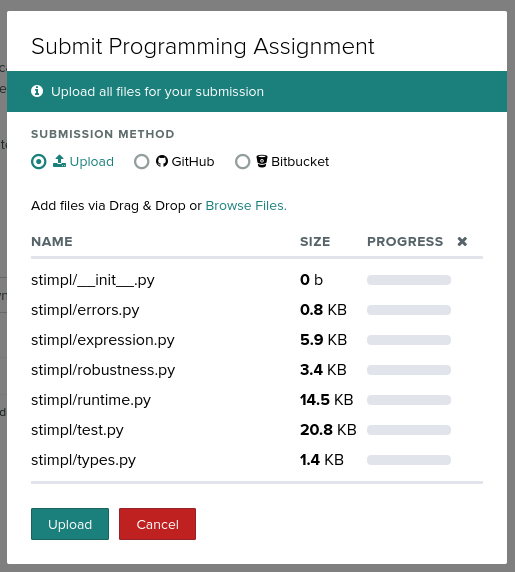

# STIMPL


STIMPL is a Turing-complete imperative programming language -- it includes dynamically typed variables, mathematical expressions, (basic) console IO, loops, and conditionals. Though the binding of variables to types is done at runtime (in particular, the time of the first assignment), the language is strongly typed -- type errors are always detected! STIMPL has no scopes and no functions.

In STIMPL, *everything* is an expression. There are no statements. The *syntax* of STIMPL might look a little odd. It's not like any other programming language you might have seen. That's because the syntax that you are going to write does not have to be the *only* syntax that STIMPL supports. Think about the syntax that you are going to learn for STIMPL as the syntax you would use to write down (*serialize*) the abstract syntax tree for a valid STIMPL program. As we discussed in the Module on Syntax and Grammars, a parser will turn the source code for a program into a tree that represents the different components of a program. Because we write STIMPL programs in the syntax defined here, we can skip the tedious steps of writing the grammar/parser/etc and jump to the fun part of building a language -- implementing its behavior!

Here is a short example STIMPL program that assigns the value of `4` (as an integer type which results from adding together two literal `2`s) to a variable `four`:

```
Program(Assign(Variable("four"), Add(IntLiteral(2), IntLiteral(2))))
```

You can _read_ that `Program` like this:

> `Assign` `Variable` `four` to the result of the `Add`ition of the `Int`-eger `Literal` `2` with the `Int`eger `Literal` of `2`.

Again, everything in STIMPL is an expression. In other words, everything in STIMPL has a value and, because STIMPL is strongly typed, everything in STIMPL has a type. The most basic expression in STIMPL is the _ren_ \-- it has no value (`None`) and a _unit_ type. In STIMPL you generate a ren like

```
Ren()
```

In STIMPL, you reference variables like

```
Variable("i")
```

Variable names are case sensitive in STIMPL.

A STIMPL program is a sequence of expressions:

```
Program(Ren(), Ren(), Ren())
```

The program above simply does nothing three times. In STIMPL, a sequence is synonymous with a program:

```
Sequence(Ren(), Ren(), Ren())
Program(Ren(), Ren(), Ren())
```

are exactly the same. In general, the syntax for a program or sequence is

`Program(`_expression_`[, `_expression_`[,...]])`

or

`Sequence(`_expression_`[, `_expression_`[,...]])`

respectively, where _expression_ is any expression (even another program or sequence because, again, *everything* in STIMPL is an expression!).

The value and type of a sequence/program of expressions are the value and type of the final expression in the sequence/program. For example:

```
Program(Assign(Variable("five"), IntLiteral(10)),\
      IntLiteral(1))
```

and

```
Sequence(Assign(Variable("five"), IntLiteral(10)),\
      IntLiteral(1))
```

have a value of 1 and type of integer.

      > Note: We have to use the `\` when we break a single STIMPL expression across multiple lines because we are using the Python parser. Because the Python language is sensitive to line breaks and indentation, the `\` at the end of the line is used to tell Python that this line "continues" on the next line and make sure that the Python parser does not treat it is a normal end-of-line. 

Yes, STIMPL supports empty `Program`s and `Sequence`s. The value and type of such a `Program`/`Sequence` is `None` and _unit_, respectively.

It stands to reason that because every expression in STIMPL has a value and a type, an assignment expression has a value and a type. An assignment expression's value and type are the value assigned and its type. For example, the assignment expression

`Assign(Variable("five"), IntLiteral(10))`

has a value of 10 and a type of integer.

In STIMPL, it's easy to print the value of an expression to the screen:

`Print(Ren())`

prints the value of the _ren_ to the screen. In general, the syntax for printing an expression is

`Print(`_expression_`)`

where _expression_ is any expression.

STIMPL has _boolean_, _string_, _floating-point number,_ _integer_, and _unit_ types. You can perform the normal mathematical operations on integers and floating-point numbers:

```
Sequence(\
      Add(FloatingPointLiteral(5.0), FloatingPointLiteral(5.0)),\
      Subtract(IntLiteral(5), IntLiteral(5)),\
      Multiply(IntLiteral(5), IntLiteral(5)),\
      Divide(FloatingPointLiteral(25.0), FloatingPointLiteral(25.0)))
```

_**All operands are evaluated left-to-right.**_

You can also perform "addition" on strings -- concatenation:

```
Add(StringLiteral("testing"), StringLiteral(", one two three."))
```

And, we can't forget about booleans!

```
BooleanLiteral(True)
BooleanLiteral(False)
```

You can operate on booleans with logical ands, ors and nots:

```
And(BooleanLiteral(True), BooleanLiteral(False))
Or(BooleanLiteral(True), BooleanLiteral(False))
Not(BooleanLiteral(True))
```

And, you can create booleans with relational and equality operators:

```
Lt(BooleanLiteral(False), BooleanLiteral(True))
Lte(IntLiteral(5), IntLiteral(5))
Eq(StringLiteral("testing"), StringLiteral("testing"))
Ne(StringLiteral("t3sting"), StringLiteral("testing"))
Gt(StringLiteral("beta"), StringLiteral("alpha"))
Gte(IntLiteral(5), IntLiteral(5))
```

The relational and equality operators are defined on all types (see below for the exact details)!

That's all well and good and gives us the power to write sequential programs. But, what about programs that need to perform certain actions selectively? STIMPL has if expressions:

```
If(And(BooleanLiteral(False), BooleanLiteral(True)),\
      Print(StringLiteral("Then")),\
      Print(StringLiteral("Else")))
```

will print

```
Else
```

Not to sound like a broken record, but because everything in STIMPL is an expression, if expressions have a value and a type. The value and type of the expression in the example above are `"Else"` and string, respectively. In general, the syntax for an if expression is

`If(` _expression_ `,`  _expression_ `, ` _expression_ `)`

where the first expression is any expression whose type is boolean and the second and third expressions have matching types. The second expression is evaluated when the value of the first expression is true. The third expression is evaluated when the value of the first expression is false.[^1]. If you don't want to do anything in the case that the value of the first expression is false, use `Ren()` as the second expression.

[^1]: It might be easier to understand the semantics of the if expression if you think of its syntax as `If(` _condition_ `,` _then_ `,` _else_ `)` where _condition_, _then_, and _else_ are expressions.

And, don't forget loops:

```
Program(\
      Assign(Variable("i"), IntLiteral(0)),\
      While(Lt(Variable("i"), IntLiteral(10)),\
        Sequence(\
          Assign(Variable("i"), Add(Variable("i"), IntLiteral(1))),\
          Print(Variable("i")))\
        )\
      )
```

That program will print:

```
1
2
3
4
5
6
7
8
9
10
```

In general, the format of a while-loop expression is

`While(` _expression_, _expression_ `)`

where the first expression is any expression with a boolean type and the second expression is any expression.[^2] The value and type of a while loop are false and boolean.

[^2]: It might be easier to understand the semantics of the while expression if you think of its syntax as `While(` _condition_ `,` _body_ `)` where _condition_, and _body_ are expressions.

# STIMPL Requirements

## Types

Any time that there is a type error, STIMPL will raise an `InterpTypeError`. STIMPL has compile-time and runtime type errors. Here are the compile-time type rules:

1.  Literals must be the appropriate type:
    1.  An `IntLiteral` must be created from a Python `int`.
    2.  A `FloatingPointLiteral` must be a Python `float`.
    3.  A `StringLiteral` must be a Python `str`.
    4.  A `BooleanLiteral` must be a Python `bool`.

If these rules are violated, STIMPL raises an `InterpTypeError` at the time the program is defined.

Here are the runtime type rules:

1.  The first assignment to a variable defines that variable's type.
2.  Once a variable's type has been defined, only values of matching type can be assigned to that variable.
3.  Both operands to binary operators must have the same type.
4.  Relational operators are defined for (matching) operands of every type (see below for the exact details).
5.  And/or/not operators are only defined for (matching) operands of boolean type.
6.  Add, Subtract, Multiply and Divide operators are defined for (matching) operands of integer and floating-point types.
7.  The add operator is defined for (matching) operands of string types and behaves like string concatenation.
8.  The condition expression in if/while expressions must have a boolean type.

If any of these these rules is violated, STIMPL raises an `InterpTypeError` at runtime.

**Examples**

By compile-time type rule (1),

```
FloatingPointLiteral(10)
IntLiteral(1.0)
StringLiteral(True)
BooleanLiteral("False")
```

will all cause `InterpTypeError`s. By runtime type rules (1) and (2),

```
Program(\
      Assign(Variable("i"), IntLiteral(10)),\
      Assign(Variable("i"), FloatingPointLiteral(10.0))\
    )
```

will cause a `InterpTypeError`. By runtime type rule (3)

```
Add(IntLiteral(5), FloatingPointLiteral(10.0))
```

will cause a `InterpTypeError`. By runtime type rule (5)

```
Program(Not(IntLiteral(5)))
```

will cause an `InterpTypeError`. By rule (8),

```
If(IntLiteral(1),
   IntLiteral(0),\
   IntLiteral(1))
```

will cause an `InterpTypeError`.

## Syntax

Because STIMPL programs are syntactically correct Python programs, most syntax errors (e.g., mismatched parenthesis) will be caught by the Python parser. However, there are two syntax errors that STIMPL handles explicitly:

1.  It is a syntax error to assign to an expression that is not a variable. If this is detected, STIMPL raises an `InterpSyntaxError` at compile time.
2.  It is a syntax error to read from a variable that does not have a value. If this is detected, STIMPL raises an `InterpSyntaxError` at runtime.

By rule (1),

```
Program(Assign(IntLiteral(10), IntLiteral(10)))
```

will cause an `InterpSyntaxError` at compile time. By rule (2),

```
Program(Variable("i"))
```

will raise an `InterpSyntaxError` at runtime.

## Semantics

1.  Relational/equality operators behave "as usual" for when the parameters are integer or floating-point types.
2.  Relational operators perform [lexicographical comparison](https://en.wikipedia.org/wiki/Lexicographic_order) when the parameters are string types.
3.  False is less than true.
4.  Unit is equal to unit.
5.  Boolean operators behave "as usual".
6.  Add, Subtract, Multiply and Divide operators work "as usual" on floating-point values.
7. The divide operator performs integer division when its parameters are integers (_e.g._, 5/10 = 0). When the operands to a division operator are both floating-points, then the result has "precision" (_e.g._, 5.0 / 10.0 = 0.5).
8. An attempt to divide by zero (either floating-point or integer) raises an `InterpMathError`.
9. The Add operator performs string concatenation when its operands are string values.
10. Operands are evaluated left-to-right.
11. There is _no_ short-circuit evaluation.
12. The expression constituting the body of a while loop is repeatedly evaluated until the expression consistituting the condition evaluates to false.
13. The expression constituting the then branch of an if expression is evaluated when the expression constituting the condition evaluates to true; the expression constituting the else branch of an if expressions is evaluated otherwise.

## Values and Types

1. Literals have the expected values and types.
2. The value and type of an assignment expression is the value and type of the right-hand side of the expression.
3. The value and type of a relational expression is the result of the relation and its type is boolean.
4. The value of a mathematical operation is the result of the mathematical operation and its type is integer or floating point, depending on the type of the parameters.
5. The value and type of an if expression is the value and type of the last expression in the sequence of expressions executed based on the value of the condition.
6. The value and type of a while expression is false and boolean.
7. The value and type of a program/sequence expression is the value and type of the last expression in the program/sequence's body
      - In the case where the body is empty, the value and the type of the program/sequence expression is ren and unit, respectively.

### STIMPL Implementation

You have been given a significant amount of skeleton code to start your implementation. Begin this assignment by understanding what is included. The best way to learn your way around the skeleton code is to write some basic STIMPL programs and see what happens!

## State

As a STIMPL program executes, it always has a state to hold the current value of the program's variables and their types. The interpreter uses the `State` class defined and (partially) implemented in the provided code (`stimpl/runtime.py`) to manage the program's state. To update values in a state, use the `set_value` method. The `set_value` method takes three parameters: The variable name, the new variable value and the new variable type. **_`set_value` will not update the state in place -- it will return a copy of the existing state with the appropriate variable updated_**. To retrieve a value from the current state, use the `get_value` method. The `get_value` method returns a tuple whose first element is the variable value and whose second element is the variable type; if `get_value` is called for a variable that is not yet defined in the current state, `None` is returned.

## Evaluate

`evaluate` (`stimpl/runtime.py`) is the main driver of the STIMPL interpreter[^3]. As parameters, it takes a variable whose type is a STIMPL expression and a variable whose type is a program state.

[^3]: That should come as no surprise given what we know about the importance of evaluation when it comes to defining the operational semantics of a language.

```Python
def evaluate(expression: Expr, state: State) -> Tuple[Optional[Any], Type, State]:
```

It returns a tuple that contains
1. (optional) value of the expression evaluated
2. that value's type
3. the (perhaps) updated state of the STIMPL program[^4]

[^4]: That looks really similar to what we would see on the right-hand side of the $\rightarrow$ in the conclusion of a rule in operational semantics.

`evaluate` is implemented with pattern matching (see the related documentation on how to write code with pattern matching in Python available on the Canvas site for this course). The pattern matching code is used to determine the specific type of expression to be evaluated. The pattern (pun intended) of using pattern matching to implement an interpreter is incredibly common and used throughout the industry.

Here are some examples of the return values of the `evaluate` function for certain STIMPL expressions.

For instance, if

```
Variable("i")
```

and `State()` were passed as `expression` and `state` (respectively) to `evaluate`,

```Python
case Variable(variable_name=variable_name):
value = state.get_value(variable_name)
if value == None:
      raise InterpSyntaxError(
            f"Cannot read from {variable_name} before assignment.")
variable_value, variable_type = value
return (variable_value, variable_type, state)

```

would execute. This implementation code generates a 3-tuple `(value, type, state)` where `value` and `type` are the value and type of `i`, respectively. Notice that the "updated" program state after evaluating this expression is no different than the program state before evaluating this expression. In other words, accessing the value of a variable does not change the program's state! Remember operational semantics!

Take a very close look at the expressions that are already implemented in `evaluate` -- there is a pattern that should emerge that will help you implement the remaining functionality!

## Interpreter Errors

There are two pre-defined exceptions for you to use to signal a program error -- `InterpTypeError` and `InterpSyntaxError` (`stimpl/errors.py`).  You can `raise` these exceptions to signal errors according to the specifications of STIMPL.

## Types

There are classes already defined for the integer, floating-point, string and boolean types (`stimpl/types.py`). These classes already have built-in functionality for equality testing. In other words,

```Python
  FloatingPoint() == FloatingPoint()
  String() == String()
```

etc. You will want to use this built-in equality functionality when checking to make sure that operands to operators are of matching type and to determine, for example, whether an operand to a boolean operator is a boolean type.

## Literals

There are classes already implemented for all literals (`stimpl/expression.py`). You may use these as they are -- they need no modification to meet the requirements of STIMPL.

## Binary, Unary and Combining-Form Expressions

There are classes already implemented to hold the structure of the binary, unary and combining-form expressions (`stimpl/expression.py`). You may use these as they are -- they need no modification to meet the requirements of STIMPL.

## Execution

`run_stimpl` (`stimpl/runtime.py`) takes a STIMPL program as a parameter and evaluates it. `run_stimpl` takes an optional second parameter to control whether debugging output is enabled. Calling `run_stimpl` with `True` as the second parameter will cause debugging output to be produced during evaluation of the STIMPL program. If the argument is missing, the default is to suppress debugging output.

## Testing

`run_stimpl_sanity_tests` (`stimpl/test.py`) is a function that will help you determine whether your implementation is "complete". Based on the skeleton code provided, one (or many) tests may fail. Guide your work on this assignment by getting each of the tests in `run_stimpl_sanity_tests` to pass.

# Assignment Requirements

Your assignment is to build on the provided STIMPL code and complete the implementation of the interpreter. All pieces of the interpreter where you need to write code are listed with `TODO` markers. For instance,


```Python
def get_value(self, variable_name) -> Any:
      """ TODO: Implement. """
      return None
```

*Note*: Where there are `TODO`s, any return values are placeholders only. You may need to modify return values as part of your implementation.

You are responsible for implementing:

| Class | Method | Expression Type |File |
| -- | -- | -- | -- |
| `State` | `get_value` | N/A | `stimpl/runtime.py` |
| N/A | `evaluate` | `Sequence` | `stimpl/runtime.py` |
| N/A | `evaluate` | `Program` | `stimpl/runtime.py` |
| N/A | `evaluate` | `Subtract` | `stimpl/runtime.py` |
| N/A | `evaluate` | `Multiply` | `stimpl/runtime.py` |
| N/A | `evaluate` | `Divide` | `stimpl/runtime.py` |
| N/A | `evaluate` | `Or` | `stimpl/runtime.py` |
| N/A | `evaluate` | `Not` | `stimpl/runtime.py` |
| N/A | `evaluate` | `If` | `stimpl/runtime.py` |
| N/A | `evaluate` | `Lte` | `stimpl/runtime.py` |
| N/A | `evaluate` | `Gt` | `stimpl/runtime.py` |
| N/A | `evaluate` | `Gte` | `stimpl/runtime.py` |
| N/A | `evaluate` | `Eq` | `stimpl/runtime.py` |
| N/A | `evaluate` | `Ne` | `stimpl/runtime.py` |
| N/A | `evaluate` | `While` | `stimpl/runtime.py` |

## Getting Started

The first step is to download the skeleton code. It is available on GitHub at [https://github.com/hawkinsw/stimpl](https://github.com/hawkinsw/stimpl). If you are new to git/github, check out this [handbook](https://guides.github.com/introduction/git-handbook/) from GitHub or the project's [website](http://git-scm.com/).

The next step is to make sure that you have Python 3.10 (or later!) installed and available. Python 3.10 is a new(er) version of Python and is a *requirement* for this assignment. If you do not have a version of Python that is newer than 3.10 you will not be able to complete this assignment. If you have trouble installing/configuring Python on your computer, please reach out to me!

The final step before you get started programming is to make sure that you can execute the code in `shakedown_stimpl.py`. If you have a reasonable installation of Python version 3.10 (or later) and everything configured correctly, you should see

```
Hello, World
```

printed on the console when you execute `shakedown_stimpl.py`

In order to judge your progress on the assignment, use the code in `test_stimpl.py`. You will know that you are almost done with this assignment when you execute the code in that file and see

```
All tests ran successfully!
```

printed on the screen! In fact, if you see that message, you will know that your grade will be at least 80% (see below).

That said, there are *many* tests in that file and the output can be overwhelming. The best way to work on this project is to implement the evaluation functionality for different expressions one at a time. For each expression type that you implement, write very small, targeted STIMPL programs that use that expression and don't move on until your code works.

## Grading

Your grade will be calculated (out of 100 total possible points) according to the following rubric:

|Points|Category|Description|
|---|---|---|
|  80 | Implementation completeness  |  You will receive up to 80 points depending on how many of the supplied tests pass on your implementation. See `stimply/test.py` for the exact relationship between points and tests. |
|  10 | Robustness  | You will receive up to 10 points depending on whether your implementation passes additional robustness tests.  |
| 10 | Hygiene | You will receive up to 10 points depending on the hygiene of your code -- good comments, good style, good variable names, modularity, etc. |


## What And How To Submit

All submissions for this assignment will be made through Gradescope, as usual. Like the first assignment, Gradescope will be relatively picky about how you submit. The best advice I can give follows:

1. Create a zip file that contains all your source code (yes, *all* your source code, even the code contained in the skeleton). 
1. In that zip file, make sure that `shakedown_stimpl.py` and `test_stimpl.py` are in the *root* folder.
1. Submit to Gradescope by dragging/dropping that zip file on the modal dialog box that pops up when you click the `Submit` button. Your dialog box should look like the one shown below).


